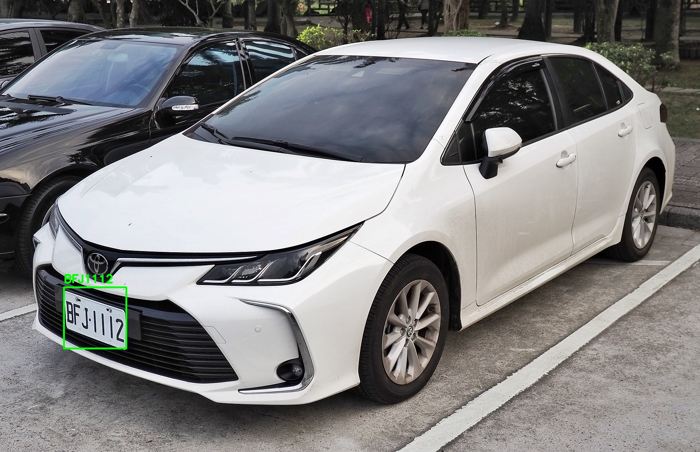

# CarPlateLicense Recognition using Yolov7-tiny

## Yolov7
* Visit https://github.com/WongKinYiu/yolov7

## Architecture Diagram

## Flow Description
- Crop the plate license from input image by using yolov7-tiny
- Split the letter from the crop image by using yolov7-tiny
- Recognize the each letter by an simple cnn
- then plot the result to the origin image

## DEMO

